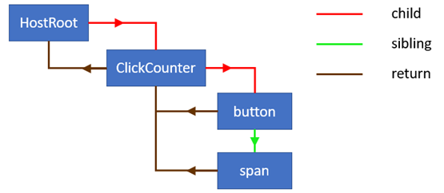

---

title: React fiber
slug: react-fiber
date: 2020-09-08
featureImage: react-fiber.jpeg
excerpt: "Inside Fiber: in-depth overview of the new reconciliation algorithm in React"

---
Ref: [Article](https://indepth.dev/inside-fiber-in-depth-overview-of-the-new-reconciliation-algorithm-in-react/)


**See following example:**

The fiber is using link list.
***
`child`, `sibling` and `return` is the next link list element;
***
Fiber node structure:
```js
{
    stateNode: new ClickCounter,
    type: ClickCounter,
    alternate: null,
    key: null,
    updateQueue: null,
    memoizedState: {count: 0},
    pendingProps: {},
    memoizedProps: {},
    tag: 1,
    effectTag: 0,
    nextEffect: null
}
```
There are 4 main functions that are used to traverse the tree and initiate or complete the work:

1. performUnitOfWork
2. beginWork
3. completeUnitOfWork
4. completeWork

To demonstrate how they are used, take a look at the following animation of

Using **dfs** to do the work. It will keep processing the next sibling after children node is completed.